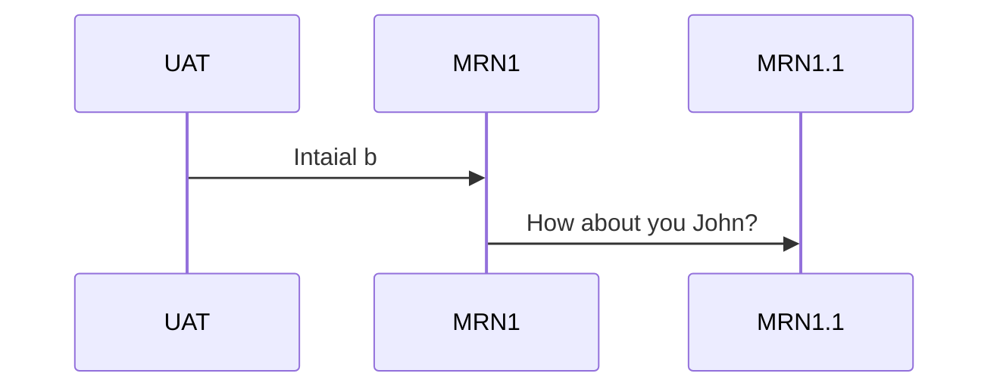

# learning-notes
Learning notes and summaries  of any CS-related learning material i love to remember.

```mermaid
sequenceDiagram
UAT ->> MRN1 : Intaial b
MRN1 ->> MRN1.1: How about you John?

```

<!--stackedit_data:
eyJoaXN0b3J5IjpbLTEwNjc1MDk0NjZdfQ==
-->