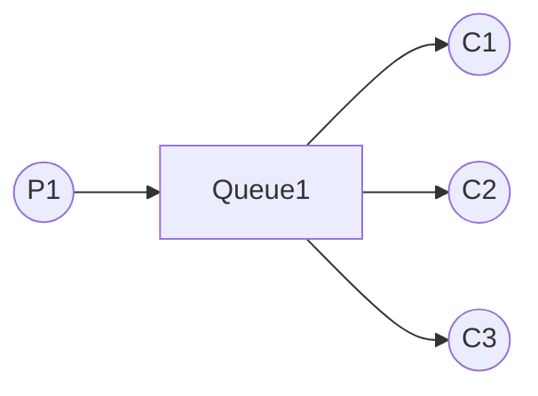
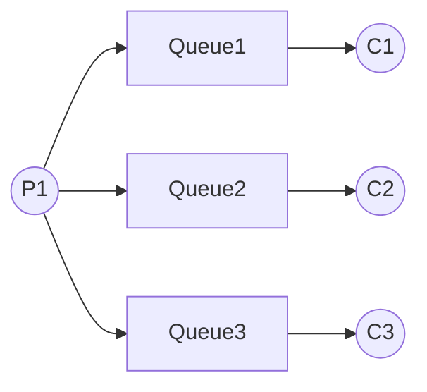

# Cloud Architecture Patterns


Summarize the `Cloud Architecture Patterns` with external resources.

## Chapter 1: Scalability Primer

- To vertically scale up is to increase overall application capacity by increasing the
resources within existing nodes. Scaling up is limited by the utilizable capability of available hardware.
- To horizontally scale out is to increase overall application capacity by adding nodes.
Horizontal scaling is more efficient with homogeneous nodes.

These scaling approaches are neither **mutually exclusive nor all-or-nothing**. Any application is capable of vertically scaling up, horizontally scaling out, neither, or both. For
example, parts of an application might only vertically scale up, while other parts might
also horizontally scale out.

Vertical scaling is often hardware- and infrastructure-focused—we “**throw hardware at the problem**”—whereas horizontal scaling is development- and architecture-focused. Depending on which scal­ing strategy is employed, the responsibility may fall to specialists in different depart­ments, complicating matters for some companies.


**Scalability can be described by:** 
- Concurrent users: the number of users with activity within a specific time interval
(such as ten minutes).
- Response time: the elapsed time between a user initiating a request (such as by
clicking a button) and receiving the round-trip response.

`Cloud-native applications allocate resources horizontally, and scalability is only one benefit.`

## Chapter 2: Horizontally Scaling Compute Pattern 

The Horizontal Scaling Compute Pattern effectively deals with the following challenges:
- Cost-efficient scaling of compute nodes is required, such as in the web tier or service
tier.
- Application capacity requirements exceed (or may exceed after growth) the capacity
of the largest available compute node.
- Application capacity requirements vary seasonally, monthly, weekly, or daily, or are
subject to unpredictable spikes in usage.
- Application compute nodes require minimal downtime, including resilience in the
event of hardware failure, system upgrades, and resource changes due to scaling.

This pattern is typically used in combination with the **Node Termination Pattern** and the **Auto-Scaling Pattern**.

**Cloud Scaling is Reversible** Cloud scaling is easily reversed. Costs vary in proportion to scale as scale varies over time.

#### Managing Session State:

 1. **Sticky sessions with Stateful nodes**
- Some web applications use sticky sessions, which assign each user to a specific web server node when they first visit. Once assigned, that node satisfies all of that user’s page re quests for the duration of the visit. This is supported in two places: the load balancer ensures that each user is directed to their assigned node, while the web server nodes store session state for users between page requests.
When stateful nodes hold the only copy of a user’s session state, there are user experience challenges. If the node that is managing the sticky session state for a user goes away, that user’s session state goes with it. This may force a user to log in again or cause the contents of a shopping cart to vanish.
- Sessions may also be unevenly distributed as node instances come and go. Suppose your web tier has two web server nodes, each with 1,000 active sessions. You add a third node to handle the expected spike in traffic during lunchtime. The typical load balancer ran­domly distributes new requests across all nodes. It will not have enough information to send new sessions to the newly added node until it also has 1,000 active sessions. It is effectively “catching up” to the other nodes in the rotation. Each of the 3 nodes will get approximately one-third of the next 1,000 new sessions, resulting in an imbalance.

___
### EXTRA (Not from the book):
[**Enabling Session Persistence with NGINX**](https://docs.nginx.com/nginx/admin-guide/load-balancer/http-load-balancer/#enabling-session-persistence)
Session persistence means that NGINX Plus identifies user sessions and routes all requests in a given session to the same upstream server.

- **IP Hash** The server to which a request is sent is determined from the client IP address. In this case, either the first three octets of the IPv4 address or the whole IPv6 address are used to calculate the hash value. The method guarantees that requests from the same address get to the same server unless it is not available.
	```
	upstream backend {
	    ip_hash;
	    server backend1.example.com;
	    server backend2.example.com;
	}
	```

- **Sticky cookie** NGINX Plus adds a **session cookie** to the first response from the upstream group and identifies the server that sent the response. The client’s next request contains the cookie value and NGINX Plus route the request to the upstream server that responded to the first request: 
    ```
    upstream backend {
	    server backend1.example.com;
	    server backend2.example.com;
	    sticky cookie srv_id expires=1h domain=.example.com path=/;
   }
    ```
- **Sticky route** NGINX Plus assigns a **“route”** to the client when it receives the first request. All subsequent requests are compared to the [`route`](https://nginx.org/en/docs/http/ngx_http_upstream_module.html#route) parameter of the `server` directive to identify the server to which the request is proxied. The route information is taken from either a cookie or the request URI.
    ```
    upstream backend {
        server backend1.example.com route=a;
        server backend2.example.com route=b;
        sticky route $route_cookie $route_uri;
    }
    ```
- **Sticky learn** NGINX Plus first finds **session identifiers** by inspecting requests and responses. Then NGINX Plus **“learns”** which upstream server corresponds to which session identifier. Generally, these identifiers are passed in a HTTP cookie. If a request contains a session identifier already “learned”, NGINX Plus forwards the request to the corresponding server:
	```
	upstream backend {
	   server backend1.example.com;
	   server backend2.example.com;
	   sticky learn
	       create=$upstream_cookie_examplecookie
	       lookup=$cookie_examplecookie
	       zone=client_sessions:1m
	       timeout=1h;
	}
	```
___

2. **Session state without stateful nodes**
A node can be kept stateless simply by avoiding storing user session state locally (on the node), but rather storing it externally. Even though session state will not be stored on individual nodes, session state does need to be stored somewhere.
User state management should be handled without sticky sessions in the web tier. Keeping nodes stateless makes them inter­changeable so that we can add nodes at any time without getting the workloads out of balance and can lose nodes without losing customer state.

**Operational Logs and Metrics:**
Managing operational data is another challenge encountered when horizontally scaling
out to many role instances. Operational data is generated during the process of operating
your application, but is not usually considered part of the business data collected by the
application itself. Examples of operational data sources:
-  Logs from IIS or other web servers
-  Windows Event Log
- Performance Counters
- Debug messages output from your application
- Custom logs generated from your application
	
## Chapter 3: Queue-Centric Workflow Pattern

The Queue-Centric Workflow Pattern is used in web applications to decouple communication between the web tier (which implements the user interface) and the service tier (where business processing happens).
Applications that do not use a pattern like this typically respond to a web page request
by having user interface code call directly into the service tier. This approach is simple,
but there are challenges in a distributed system. One challenge is that all service calls
must complete before a web request is completed. This model also requires that the
scalability and availability of the service tier meet or exceed that of the web tier, which
can be tenuous with third-party services. A service tier that is unreliable or slow can
ruin the user experience in the web tier and can negatively impact scalability.

Commands are sent in the form of messages over a queue. 
In the simplest (and most common) scenarios, the pattern is trivial: the sender adds
command messages to the queue (enqueues messages), and a receiver removes those
command messages from the queue (dequeues messages) and processes them. 

The sender and receiver are said to be **loosely coupled**. They communicate only through
messages on a queue. This pattern allows the sender and receiver to operate at different
paces or schedules; the receiver does not even need to be running when the sender adds
a message to the queue. Neither one knows anything about the implementation of the
other, though both sides do need to agree on which queue instance they will use, and
on the structure of the command message that passes through the queue from sender
to receiver.

**Invisibility window and at-least-once processing**
During a message’s invisibility window, there is usually exactly one copy of the message
being processed. There are a couple of edge cases where this might not be true. One edge
case is when the code processing the message has not finished, but the invisibility window
lapses, and another copy of the same message gets dequeued. At this point, there are two
active copies of that message being processed. If this happens, it may be due to a bug in
your code. Instead of exceeding the invisibility window, you should inform the queue that
you are still working on this message and increase its invisibility window to allow sufficient
time with exclusive access.

---
### EXTRA (Not from the book):

**How confirmation is done inside `RabbitMQ`?** From [RabbitMQ Reliability Guide:](https://www.rabbitmq.com/reliability.html)

Use of acknowledgements guarantees **at least once** delivery. Without acknowledgements, message loss is possible during publish and consume operations and only **at most once** delivery is guaranteed.

Acknowledgements therefore have semantics. A consuming application should not acknowledge messages until it has done whatever it needs to do with them: recorded them in a data store, forwarded them on, or perform any other operation. Once it does so, the broker is free to mark the delivery for deletion.
Similarly, the broker will confirm messages once it has taken responsibility for them. The details are covered in the [Acknowledgements and Confirms guide](https://www.rabbitmq.com/confirms.html).

---

**Idempotent processing**
An idempotent operation is one that can be repeated such that any number of successful
operations is indistinguishable from a single successful operation.
Consider a command to create a new user account based on a user-provided email
address and the message dequeue count is two. Proper processing needs to consider the
possibility that some (or all) of the processing work has been done previously and so
needs to act smartly. Exactly how to “act smartly” will vary from application to appli­cation

---
### EXTRA (Not from the book): 
**How Idempotent processing done inside `RabbitMQ`?**
Processing of `requeued` messages can be done in `RabbitMQ` with checking for the [`Redelivered`](https://www.rabbitmq.com/consumers.html#message-properties) flag.

Or can be done by keeping a `track` of messages processed, and before processing a message, check if it has been processed before or not!

---

**Poison messages**
Some messages cannot be processed successfully due to the contents of the message.
These are known as poison messages.
Consider a message containing a command to create a new user account based on a
user-provided email address. If it turns out that the email address is already in use, your
application should still process the message successfully, but not create a new user ac­
count. This is not a poison message.
But if the email address field contained a 10,000-character string and this is a scenario
unanticipated in your application code, it may result in a crash. This is a poison message.
If our application crashes while processing a message, eventually its invisibility window
will lapse, and the message will appear on the queue again for another attempt. The need
for idempotent handling for that scenario is explained in the previous section. When
dealing with a poison message, the idempotent handling will never terminate.

Once a poison message has been identified, deciding how to deal with it is another
business decision. If it is desirable to have a human review the poison messages to con­
sider how to improve handling, then one approach is to use what is known as a dead
letter queue, a place for storing messages that cannot be processed normally.

---
### EXTRA (Not from the book): 
**How dealing with poison messages done inside `RabbitMQ`?**

[Quorum queue](https://www.rabbitmq.com/quorum-queues.html) support handling of [poison messages](https://en.wikipedia.org/wiki/Poison_message), that is, messages that cause a consumer to repeatedly requeue a delivery (possibly due to a consumer failure) such that the message is never consumed completely and [positively acknowledged](https://www.rabbitmq.com/confirms.html) so that it can be marked for deletion by RabbitMQ.

Quorum queues keep track of the number of unsuccessful delivery attempts and expose it in the `x-delivery-count` header that is included with any redelivered message.

It is possible to set a delivery limit for a queue using a [policy](https://www.rabbitmq.com/parameters.html#policies) argument, delivery-limit.

When a message has been returned more times than the limit the message will be dropped or [dead-lettered](https://www.rabbitmq.com/dlx.html) (if a DLX is configured).

---


A full CQRS treatment would also consider event sourcing and Domain Driven Design (DDD). With event sourcing, as commands result in system state changes, resulting change events are captured and stored individually rather than simply reflecting the change in the master data. For example, an address changed event would hold the new address information rather than just overwrite a single address field in a database. The result is a chronological history that can be replayed to arrive at current state (or any state along the
way). Using event sourcing may simplify handling idempotent operations. DDD is a technology-agnostic methodology to understand business context. Neither event sourcing nor DDD are required with CQRS, but they are frequently used together.

**Scaling Tiers Independently**
The queue length and the time messages spend in the queue are useful environmental signals for auto-scaling. The cloud queue services make these key metrics readily avail­able. A growing queue may indicate the need to increase capacity in the service tier, for example. Note that the signals might indicate that only one tier or one specific processing service needs to be scaled. This concern-independent scaling helps to optimize for cost and efficiency. At very high scale, the queue itself could become a bottleneck requiring multiple queue instances. This does not change the core pattern.

---
### EXTRA (Not from the book): 

**Different architectures to process messages**
1. Competing Consumers pattern:

Use this pattern when:

-   The workload for an application is divided into tasks that can run asynchronously.
-   Tasks are independent and can run in parallel.

This pattern might not be useful when:

-   It's not easy to separate the application workload into discrete tasks, or there's a high degree of dependence between tasks.
-   Tasks must be performed synchronously, and the application logic must wait for a task to complete before continuing.
-   Tasks must be performed in a specific sequence.

2. Multi Queue

<!--stackedit_data:
eyJoaXN0b3J5IjpbMTM2ODQ3OTI0MywtMTA5NDQyODM3NSwzOT
M0MTEzNzIsOTQwNzY5NzY0LDEzODcxMjgwODIsLTExMjQwMjEz
MDYsLTE2NjAwMjU0OTUsMjA5ODkxMzcwOCwxNTE3ODM5NDE1LD
Q2MzUyMDEwOSwxNjAzMjAzNDI3LC0xNzgwODQwOTI2LDc1MTgx
NzA3MywzMDA2MjE4NCwtMTczNDQwODI3NywxNDE0MTQ5NDY1LC
0yMzEzMzAzOTUsLTE1NjIzNDc1MjksLTExMzk0NjI0NjIsLTEz
MDE0MTUzMzJdfQ==
-->